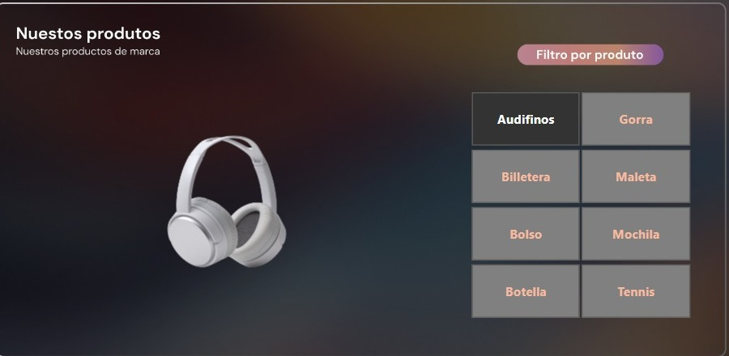
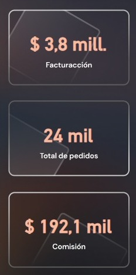
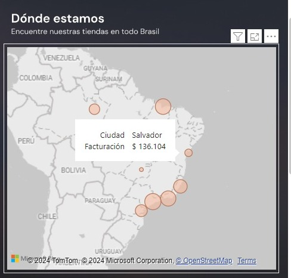
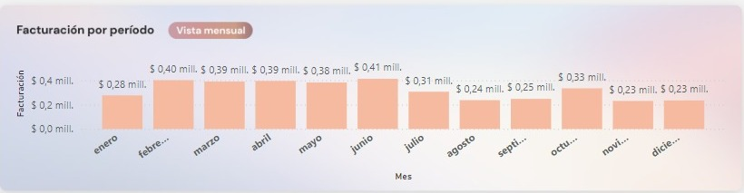
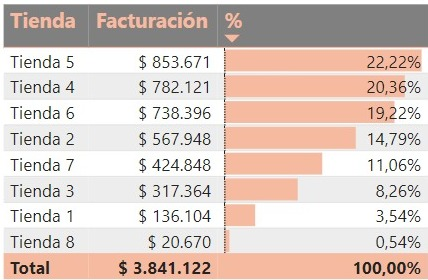

# Dashboard de Seguimiento Financiero de Productos

Este repositorio contiene un dashboard de Power BI que proporciona un análisis detallado del seguimiento financiero de varios productos. Los productos incluidos son: audífono, gorra, billetera, maletas, bolso, mochila, botella y tennis.

## Descripción del Proyecto

El dashboard fue creado utilizando una base de datos proporcionada en un curso. La base de datos incluye tres tablas principales:
- **RegistroVentas**: Información de las ventas realizadas.
- **Productos**: Detalles de los productos vendidos.
- **Tiendas**: Información sobre las tiendas donde se realizaron las ventas.

### Transformación de Datos

Se realizaron varias transformaciones en las tablas para asegurar que los datos fueran útiles y coherentes. Las tablas se unieron adecuadamente para permitir la creación de gráficos interactivos y un análisis completo.

### Visualizaciones Incluidas

El dashboard incluye las siguientes visualizaciones:
- **Gráfico de Mapa**: Muestra la distribución geográfica de las ventas.
- **Imagen Grid**: Visualización de los 8 productos con imágenes representativas.
- **Gráfico de Columnas Apiladas**: Facturación por periodo mensual.
- **Tabla de Facturación**: Muestra la facturación por tienda y su porcentaje correspondiente.
- **Tarjetas Informativas**:
  - Facturación Total
  - Total de Pedidos
  - Comisión Total

## Capturas de Pantalla
### Grid de Imágenes
Visualización de los 8 productos disponibles con imágenes representativas, facilitando la identificación de cada producto.

### Tarjetas Informativas
Visualización de la facturación total, el total de pedidos y la comisión total, proporcionando un resumen rápido de los indicadores clave de desempeño.

### Gráfico de Mapa
Muestra la ubicación de varias ciudades de Brasil y la facturación por cada producto en dichas ciudades.

### Gráfico de Columnas Apiladas
Visualiza la facturación por periodo mensual, permitiendo un análisis detallado de las ventas a lo largo del tiempo.

### Tabla de Facturación
Muestra las tiendas disponibles con su facturación individual y el porcentaje de facturación que representa cada tienda.

## Instrucciones para Usar

1. Descarga el archivo `.pbix` de este repositorio.
2. Abre el archivo con Power BI Desktop.
3. Explora las diferentes visualizaciones e interactúa con los datos para obtener insights detallados.

## Datos

Los datos utilizados para este dashboard se encuentran en las tablas `RegistroVentas`, `Productos` y `Tiendas`. Los datos han sido transformados y limpiados para garantizar su utilidad y precisión en el análisis.

## Agradecimientos

Agradecimientos al curso proporcionó la base de datos utilizada para este proyecto.

---

¡Gracias por visitar este repositorio! No dudes en dejar tus comentarios y sugerencias.
